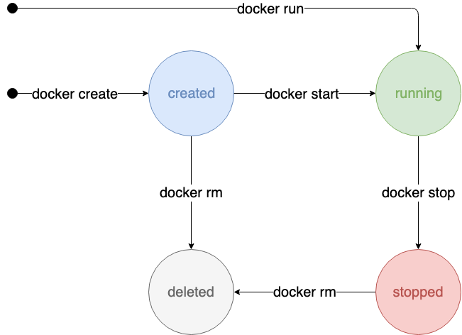

# Workshop Docker - Modulo 5

Concetti in questo modulo:
- Diamo un senso ai comandi run, exec e start
- Statistiche di utilizzo delle risorse

## Ciclo di vita di un container
Per capire come funzionano i comandi __run__, __exec__ e __start__ è necessario dare un occhio agli internals di docker.


http://docker-saigon.github.io/img/event_state.png

OOOOOK, il diagramma sopra è piena d'informazioni e risulta un po' complicata, almeno per il taglio di questo workshop! L'ho riportata giusto per completezza.

Qui sotto ho messo una vesrione semplificata e credo che contenga tutti i concetti utili per un workshop introduttivo.



### create
Il comando __create__ crea un nuovo _container_ basato sulla _image_ che volete! ma non si limita a fare solo questo...

Tramite il comando __create__ è possibile inizializzare il _container_ sfruttanto parecchie opzioni, per esempio:
* inizializzare l'interfaccia di rete interna al _container_ (ip, hostname, dns, host file, etc.)
* definire le risorse massime utilizzabile dal _container_ (CPUs, RAM, device iops e bps, etc.)
* definire policy di sicurezza (cgroups, isolation, etc.)
* esporre e mappare porte e volumi
* definire variabili d'ambiente (direttamente o tramite file)
* fare overwrite del __ENTRYPOINT__ definito nel _Dockerfile_
* un sacco di altre opzioni

### start
Il comando __start__ si limita, per davvero, ad avviare uno o più _container_ ed eseguire le istruzioni presenti negli __ENTRYPOINT__ e/o nei __CMD__ del _container_. 

Questo comando ha poche opzioni:
* -a, --attach : redirige lo STDOUT/STDERR e i _signals_
* -i, --interactive : redirige lo STDIN
La particolarità di questo comando è che esso accetta un elenco di _container_ e li avvia tutti. 

Come comportamento di default il comando _start_ esegue i _container_ in modo __detached__, cioè senza redirect di STDOUT/STDERR, quindi eseguendo un _container_ non vedremo in console alcun messaggio di quello che sta accadendo.

### run
Il comando __run__ crea un _container_, lo avvia ed esegue un comando al suo interno.
In pratica il comando __run__ esegue in successione il comando _create_ e poi il comando _start_.

Le opzioni messe a disposizione dal comando __run__ corrispondono, con buona approssimazione, alle opzioni messe a dispozione dal comando _create_ più quelle del comando _start_.
A differenza del comando _start_, ma come il comando _create_ accetta come parametro una sola immagine e crea ed esegue un solo _container_.

Il comando _run_, come comportamento di default, avvia il _container_ in modo __attached__, cioè facendo il redirect di STDOUT/STDERR e questo ci permette di visualizzate il risultato dei comandi eseguiti internamente al _container_.

### exec
Esegue un comando all'interno del _container_. Esso non ha alcune legame con i comandi definiti nelle istruzioni __ENTRYPOINT__ e __RUN__.

Come impostazione di default vine eseguito in modo _attached_, ma non interattivo (senza redirect di STDIN) e senza allocare uno pseudo-TTY ... ricordate che negli esempi precedenti abbiamo eseguito una shell linux internamente al _container_ e usando le opzioni `-i -t` o `-it`? queste opzioni ci hanno permesso di utilizzare la bash internamente al _container_!
Possiamo definire un environemt particolare o una workdir e passarli come parametri al comandoi _exec_.

## Interrogare docker per vedere processi e risorse
Dovremmo aver imparato a creare _images_ ed eseguirle sotto forma di _container_.
Giunti a questo punto dovremmo essere consapevoli di come funziona _docker_, di alcuni principi rigardanti i _container_ e dovremmo avere ababstanza dimestichezza per creare i nostri _container_ e le nostre _images_.

Manca ancora un tassello molto importante, ~~se vogliamo essere persone migliori~~, diventare consapevoli di cosa stiamo eseguendo all'interno dei _container_ e le risorse da essi utilizzate.

Esistono due comandi:
* _docker container stats_ : mostra le statistiche delle risorse utilizzate da tutti i _container_ in esecuzione
* _docker container top_ : mostra i processi in esecuzione all'interno del _container_

Tramite il comando `docker ps` siamo in grado di vedere i _container_ che sono stati creati e il loro stato.
```bash
bombo82@nolok ~ $ docker ps -a
CONTAINER ID        IMAGE                          COMMAND                  CREATED             STATUS                     PORTS               NAMES
d15ba079e337        nginx                          "nginx -g 'daemon of…"   4 minutes ago       Up 4 minutes               80/tcp              vigorous_gates
edf44932644f        hello-http-configurable:v0.1   "nginx -g 'daemon of…"   4 minutes ago       Up 4 minutes               80/tcp, 443/tcp     adoring_tereshkova
422a253e9931        hello-http-configurable:v0.1   "nginx -g 'daemon of…"   4 minutes ago       Created                    80/tcp, 443/tcp     boring_beaver
7d814b8c44ac        hello-http-configurable:v0.1   "nginx -g 'daemon of…"   4 minutes ago       Exited (0) 4 minutes ago                       eloquent_turing
```

Tramite il comando `docker stats` è possibile monitorare lo stato dei nostri container. Il comando mostra le statistiche delle risorse utilizzate da tutti i _container_ in esecuzione e, a differenza degli altri comandi fin qui utilizzati, rimane in _"watch"_, cioè il comando blocca il nostro terminale e i dati che ci mostra vengono aggiornati in automatico ogni _n_ secondi.
```bash
bombo82@nolok ~ $ docker stats

CONTAINER ID        NAME                 CPU %               MEM USAGE / LIMIT     MEM %               NET I/O             BLOCK I/O           PIDS
d15ba079e337        vigorous_gates       0.00%               3.285MiB / 15.32GiB   0.02%               2.61kB / 432B       31.7kB / 0B         2
edf44932644f        adoring_tereshkova   0.00%               2.859MiB / 15.32GiB   0.02%               4.93kB / 432B       0B / 0B             2
```

Un comando molto utili per comprendere cosa sia in esecuzione all'interno del conrainer è il comando `docker top` che sostanzialmente ci nmostra i processi in esecuzione, esattamente come se avessimo eseguito il comando linux all'intreno del _container_ stesso..
```bash
bombo82@nolok ~ $ docker top edf44932644f
UID                 PID                 PPID                C                   STIME               TTY                 TIME                CMD
root                7406                7381                0                   10:16               ?                   00:00:00            nginx: master process nginx -g daemon off;
101                 7499                7406                0                   10:16               ?                   00:00:00            nginx: worker process
```

Notate come all'interno del _container_ non sia in esecuzione il sistema operativo, ma solo i processi che abbiamo lanciato tramite le istruzioni **ENTRYPOINT**, **CMD** oppure passate dell'esterno tramite il comando `docker run`.

## Riassunto
Facciamo un breve riassunto dei comandi e delle opzioni finora utilizzate:

Management Command | Command | Option | Behavior
-------------------|---------|--------|---------
image | pull | | Pull an image or a repository from a registry
image | ls | | List images
container | run | | Run a command in a new container
| | | -i, --interactive | Keep STDIN open even if not attached 
| | | -t, --tty | Allocate a pseudo-TTY
container | exec | | Run a command in a running container
| | | -i, --interactive | Keep STDIN open even if not attached 
| | | -t, --tty | Allocate a pseudo-TTY
container | start | | Start one or more stopped containers
container | stop | | Stop one or more running containers
container | ls | | List running containers
| | | -a, --all | Show all containers (default shows just running)

___

[prev](../module04/README.md) [home](../README.md)

Copyright (C) 2018-2019 Gianni Bombelli and Contributors

[](https://creativecommons.org/licenses/by-sa/4.0/)

Except where otherwise noted, content on this documentation is licensed under a [Creative Commons Attribution-ShareAlike 4.0 International License](https://creativecommons.org/licenses/by-sa/4.0/).

Images from [Play with Docker classroom](https://training.play-with-docker.com/about/)
